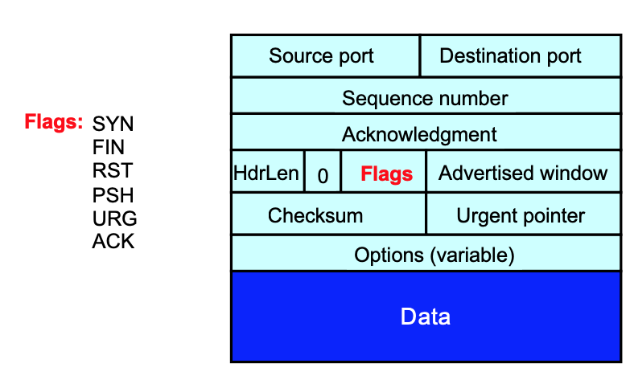

## Commons

- Transport layer;
- Port (demultiplexing)
- Error detection: checksums;

### UDP

#### 8 bytes header (each 2 bytes = 16 bits)

[SRC PORT] [DST PORT] [CHECKSUM] [LENGTH]

#### No connection set-up delay

UDP sends without establishing a connection;

> While TCP needs to establish a connection and then communicate;

Thus, no connection state in the host OS;

No buffers, parameters, sequence #s, etc.

#### Other benefits

* UDP sends as soon as the application writes;

#### Who are using it

Query DNS;

Real-Time data in VoIP;

### TCP

#### Connection oriented

Explicit set-up and teardown of TCP connection

#### Reliable, in-order delivery

Reliability:

**Corruption**: Checksums;

**Missing data**: sequenec numbers;

**Recover from lost data**: Retransmission;

#### Flow control

Prevent overflow of the receiver's buffer space;

#### TCP Segments

**IP Packet**: LEN <= MTU (Maximum Transmission Unit: up to 1500 bytes on an Ethernet link)

**TCP Packet**: A header with 20 bytes long; += IP packet;

**TCP segment**: No more than MSS (Maximum Segment Size) bytes;

Usually: MSS = MTU - IP header - TCP header;

#### ARQ: Automatic Repeat reQuest

ACK + timeouts

Simplest ARQ protocol:

- Wait for an ACK until timeout;

#### Change of the ISN(Initial Sequence Number) number!

**Fact**: The de facto ISN is not always 0; (but random integers)

**Why**: Port numbers may be reused by processes;

> An old packet may still be in flight, .. and wrongly associated with the new conncetion;

So, TCP must change the ISN over time (a kernel state):

Set from a 32-bit clock that ticks every 4 microsec (which wraps around once every 4.55 hours!);

### TCP Flow Control => Sliding Window

Motivation: Stop-and-wait is inefficient

> Only one TCP segment is "in flight" at a time; => Allow larger amount of data in flight;

#### Timeouts

- Sender sets a timeout for awaiting ACK;
  - Short: wasted retransmissions;
  - Long: excessive delays when packet lost;

> The receiver may resend `ACK N` is packet N is not received when timeout is expired;

- TCP sets timeout as a function of the RTT (rount-trip-time);
- How does the sender know the RTT?
  - Running average of delay to receive an ACK;

#### Timeouts are slow => RTT

> If the sender already got `ACK N`, but then it again got  `ACK N `twice:
>
> This means that the packet is received after timeout. (the connection is not lost but just kinda slow)

> Thus, we can control the sender not resend the packet (which wastes the bandwidth) but just wait a little longer;
>
> But what if a real packet loss happened?
>
> **Fast Retransmission**
>
> Let's say if the sender received 3 ACK N(it has been for 3 timeout rounds that the packet is not received), we pay a new transmit (with the real data);

> When does Fast Retransmit work best? 
>
> * High likelihood of many packets in flight; (temporal correlation)
> * Long data transfers, large window size, … (A long timeout will stagnate the whole sliding window)

#### Implications for Web traffic

> Many web transfers are short (shor HTTP requests)
>
> - Often there aren't many packets in flight;
>
> Making fast retrainsmit is less likely to “kick in”
>
> * Users may use `reload` to early end the timeout;

### TCP Handshakes

#### Establishing a TCP connection

Three-way handshake:

* A -> SYN (open) -> B  [A timer is actually ]
  * B knows A wants to be connected, I should let A know my decision;
* B -> SYN ACK -> A 
  * A now knows B's decision, and he also need to make sure B is aware of A's receiving the news; A can now start sending the data;
* A -> ACK -> B
  * B knows A had received that, a connection starts; A tells B 

TCP header;

> Why 3-way handshake?
>
> For each side, the premise of bilateral communcation is that:
>
> * You can be heard;
> * I can be heard by you;

|      | A knows A -> B | A knows B -> A | B knows A -> B | B knows B -> A |
| ---- | -------------- | -------------- | -------------- | -------------- |
| A->B |                |                | ✅              |                |
| B->A | ✅              | ✅              |                |                |
| A->B |                |                |                | ✅              |

The same for the tearin- down;

The premise of  tearing-down  is that:

* A knows B got all data;
* B knows A got all data;
* A knows A got all data;
* B knows B got all data;

> Finish (FIN) to close and receive remaining bytes

|           | AB   | AA   | BA   | BB   |
| --------- | ---- | ---- | ---- | ---- |
| A->B: FIN |      |      |      | ✅    |
| B->A: ACK | ✅    |      |      |      |
| B->A: FIN |      | ✅    |      |      |
| A->B: ACK |      |      | ✅    |      |

> Why cannot we just combine ACK + FIN?
>
> Because the data of the other side may not be finished;

Order requirement: FIN must be ahead of ACK for one side;