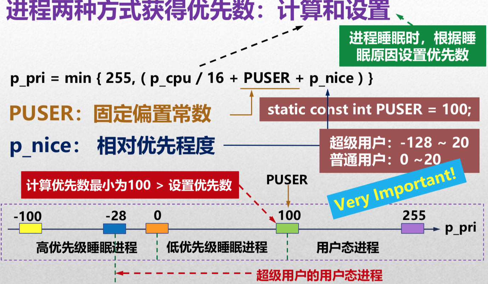
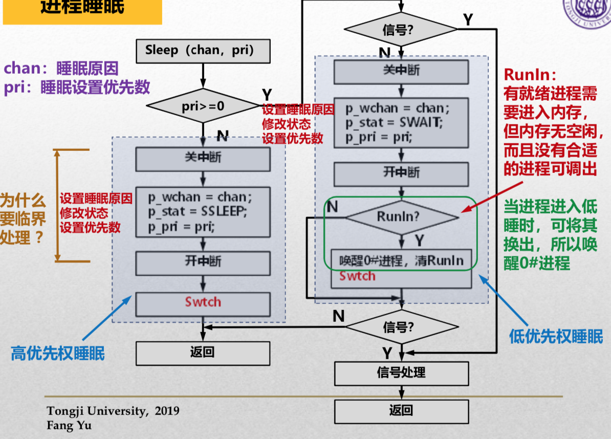
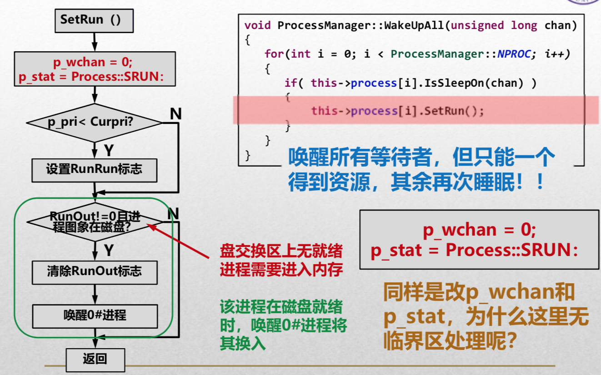

# UNIXV6++

[TOC]

## Memory Layout & Page Table


- 由于页表区是从2MB的位置开始，所以页表区Page Directory的位置在`%CR3`指向的位置`0x200000`，即`0x200`号页框（少3个0是因为每页4KB）
- 每号页框可以装4MB页，即总共1024页；
- 进程上台时，将装入`0x202`和`0x203`号页框。
- 内容
  - `0x200`页框：二级页表（其他的页框，上台进程页框都）
  - `0x201`页框：PPDA和其他，其中`1023#`存放PPDA区（只占4K）；
  - `0x202`页框：装一些用户态的东西；
  - `0x203`页框：`0`号PTE同上，然后之后的部分按`[代码段]+[数据段]`，其中只使用`1#, 2#, 3#, 1023#`。

## Process Management


### Process类

#### 数据成员


💙`p_stat`:

- `SNULL` 未初始化
- `SSLEEP` 高优先权睡眠状态（根据睡眠的原因定义睡眠的优先权）
- `SWAIT` 低优先权睡眠状态
- `SRUN` 运行|就绪
- `SIDL` 进程正在创建
- `SZOMB` 僵尸转状态
- `SSTOP` 正在被追踪❓

💙`p_flag`: 进程标志位（可有多个状态） => `XXXX` (前4个bit很重要)

- `SLOAD` 进程图像在内存中
- `SSYS`系统进程（0号进程一直在内核，永远不会被换出）
- `SLOCK`  暂时不允许被换出
- `SSWAP` 被创建的时候就在交换区（此时内存太紧张）
- `STRC`
- `STWED`

#### 成员函数


### ProcessManager类


### 调度状态

`SRUN`+`SLOAD` ~ 值为3；（不能通过3这个值来确定）

通过user确定先运行进程（找PPDA区的User对象）：

`GetUser() return *(User*)(0x400000 - 0x1000)`;

然后`User::u_procp`就是我们的现运行进程的位置。

### 主动放弃

- 外设：`int 0x80`；
- IO后`Process::Sleep`（调用`Swtch`）；
- 高优先权睡眠状态`p_pri ∈ [-100, 0)`：`SSLEEP SLOAD` (快速设备先睡，即快速设备先IO) Lower is 优先级越高，因为`p_pri`小，醒来后更加优先的被上台；
- 低优先权睡眠状态`p_pri ∈ [0, 100)`：`SWAIT SLOAD`；
- 具体的优先数看事件类型；
- 醒来后，内核态的进程的`p_pri < 100`；
- (只对当前进程)Trap的最后重新计算优先数 =>【即将回用户态，核心态下没事干了】例行调度（此时设置其优先权`>=100`）
- 系统调用前是用户态 => `RUNRUN`
- 直到再次被选择上台菜算完整的完成了系统调用

> 睡完的SRUN SLOAD时候的`p_pri`
>
> - 【即将返回用户态时进行调度】 `>= 100`
> - 【即将睡醒进行调度】`  < 100`

### 强迫调度

> 内存不够的时候；


- 睡觉的进程进入交换区的时候，只有当其被唤醒后才有可能出来；
- 创建新教程的时候也有可能进入交换区；

## 优先级

### 内核态

根据睡眠原因**设置**；

### 用户态

$$
ppri=\min{(255, \frac{pcpu}{16}+pnice+\rm PUSER)}
$$

- 普通用户的进程`p_pri`默认大于100；
- `p_nice`用户定义的相对优先级
  - 超级用户：-128~20
  - 普通用户：0~20
- PUSER 固定偏置数；



- 和优先级相关的变量：`p_cpu`
- 时钟中断时有2次**修改**`p_cpu`：
  - 每次时钟中断：`++p_cpu`
  - 每秒结束，修正`p_cpu -= SCHMAG`

### 修改`p_pri`的时机

- 每秒，所有优先数>`PUSER`的进程重新计算优先数；
- 每秒，重新计算当前进程的优先级；
- 系统调用的末尾，重新计算当前进程的优先数；

```c++
void SetPri()
{
  	...
    if( priority > procMgr.CurPri) // 宣告自己的优先级显著下降
      	++proMgr.RunRun;					
  	...
}
```

## 0号进程

- 只有核心态
- 没事的时候就睡眠，有事的时候就上台；

### context switching

- **Swtch**
- 保护现场
- 将现运行进程变为0#进程
  - 设置0#进程的核心态页表（没有用户态代码，只有核心态代码，所以只需要装入核心态下用的页表）
  - 恢复0#进程的esp和ebp
  - 0#睡觉时的优先级为-100（only one）
- 选择新进程【已进入0#】
  - 找就绪态、图像再内存、优先权最高者；
- 运行新进程
  - 设置新进程的核心态页表
  - 恢复新进程的esp和ebp
- 设置新进程用户页表
- 如果新进程由SSWAP标志(在盘交换区中)，用新进程的`u_ssav`数组再次恢复`esp`和`ebp`。
- `return 1` （是否首次上台）❓

> **<u>新进程有可能就是原进程。</u>**
>
> *<u>三个进程可能都是0号进程。</u>*

### 进程睡眠



#### 为什么关中断

> 要保证`p_wchan`和`p_stat`一致；

假设被其他人打断的后果：

```c++
p_wchan = chan;
// interrupt ~ CONTEXT SWITCHING
// 此时中断过程中『唤醒进程』：
// p_wchan = 0;
// p_stat = Process::SRUN;
p_stat = SSLEEP;
// 此时p_stat一直SSLEEP
```

#### SWAIT进程

- RunIn代表：你要放弃处理机、你要放弃内存后再去睡；
- 「放弃内存」需要0#进程帮忙；
- 睡觉前检查一下信号量（而高睡比较紧急，不检查信号就睡觉了）

### 唤醒睡眠

- 如果`p_pri < Curpri`，那么设置RunRun；
- 如果进程图像在磁盘上且`RunOut != 0`（RunOut == 0: 进程图像在从磁盘往内存搬，RunOut != 0：磁盘就绪）=> 呼唤0#进程搬运内存；



### Sched 

- 每秒`p_time++`
- 优先调出低睡进程（就睡一小会）
- 对于高睡进程：
  - `p_time > 3`  才有可能将其调入；
  - `p_time > 2 `才可能调出；(你得占用2s CPU才能回磁盘)
- 无进程可**调出**：0# `RunIn++, Sleep(&RunIn, -100)`