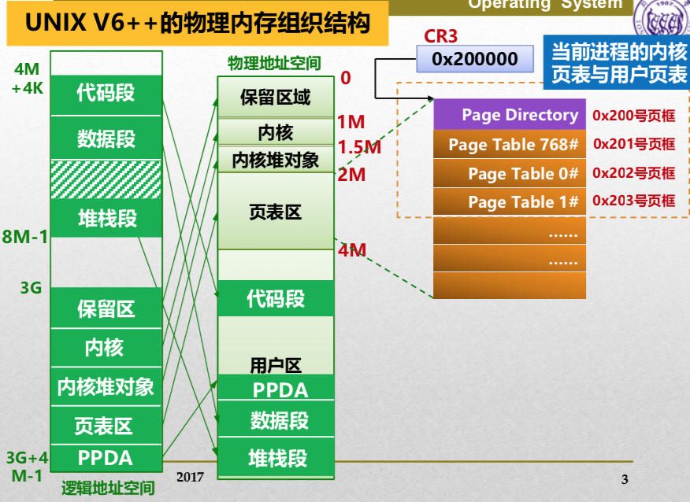
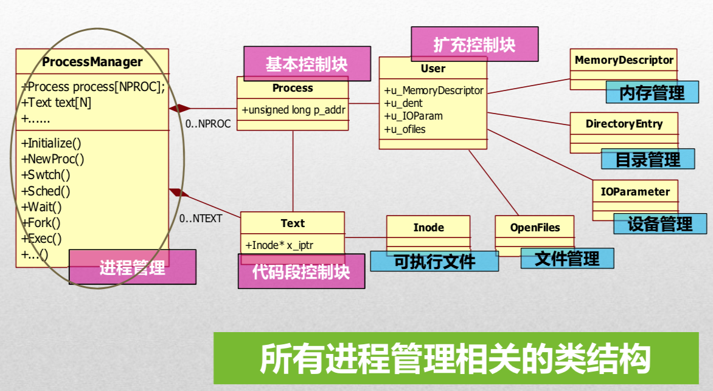
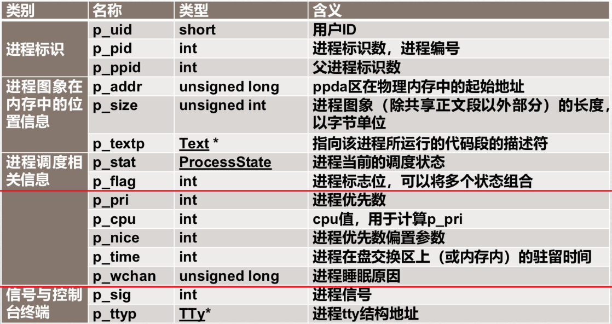
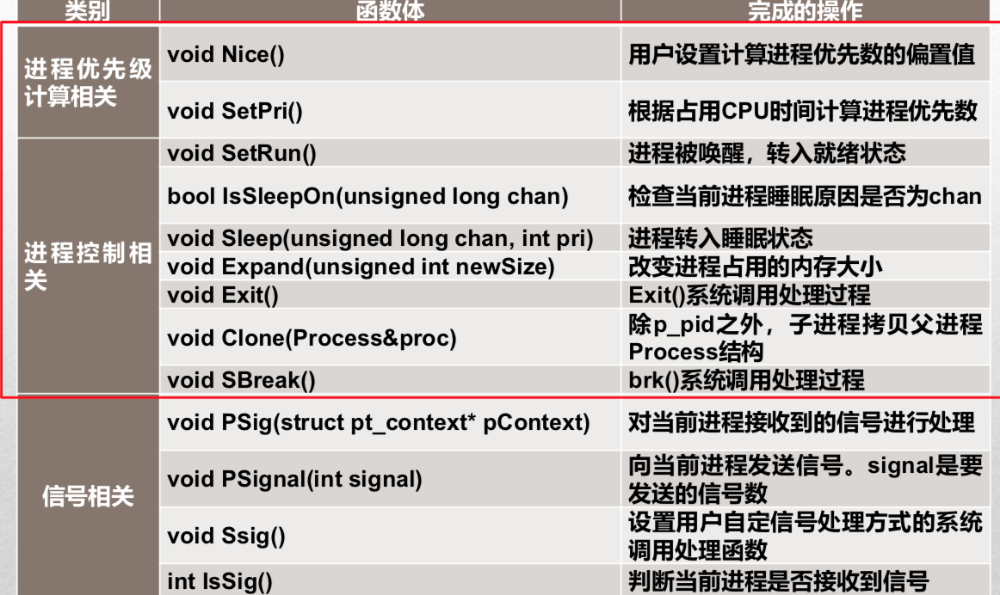
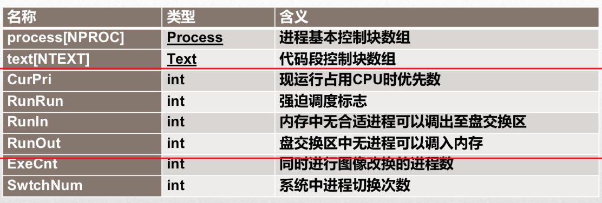
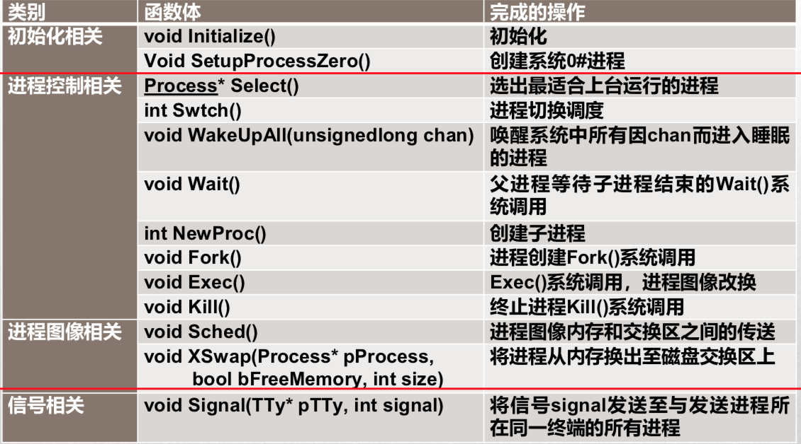
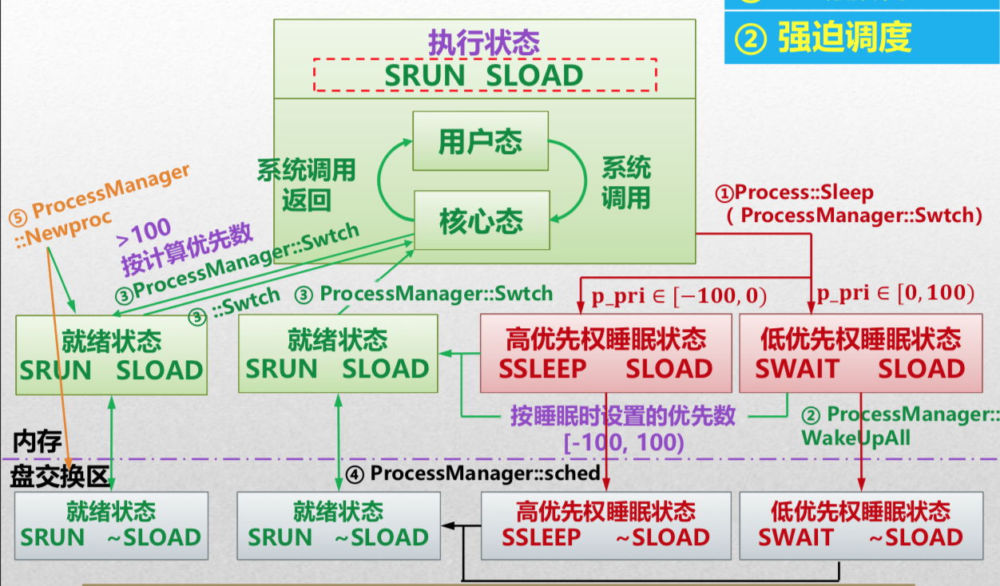

# UNIXV6++

[TOC]

## Memory Layout & Page Table

- 由于页表区是从2MB的位置开始，所以页表区Page Directory的位置在`%CR3`指向的位置`0x200000`，即`0x200`号页框（少3个0是因为每页4KB）
- 每号页框可以装4MB页，即总共1024页；
- 进程上台时，将装入`0x202`和`0x203`号页框。
- 内容
  - `0x200`页框：二级页表（其他的页框，上台进程页框都）
  - `0x201`页框：PPDA和其他，其中`1023#`存放PPDA区（只占4K）；
  - `0x202`页框：装一些用户态的东西；
  - `0x203`页框：`0`号PTE同上，然后之后的部分按`[代码段]+[数据段]`，其中只使用`1#, 2#, 3#, 1023#`。

## Process Management

### Process类

#### 数据成员

💙`p_stat`:

- `SNULL` 未初始化
- `SSLEEP` 高优先权睡眠状态（根据睡眠的原因定义睡眠的优先权）
- `SWAIT` 低优先权睡眠状态
- `SRUN` 运行|就绪
- `SIDL` 进程正在创建
- `SZOMB` 僵尸转状态
- `SSTOP` 正在被追踪❓

💙`p_flag`: 进程标志位（可有多个状态） => `XXXX` (前4个bit很重要)

- `SLOAD` 进程图像在内存中
- `SSYS`系统进程（0号进程一直在内核，永远不会被换出）
- `SLOCK`  暂时不允许被换出
- `SSWAP` 被创建的时候就在交换区（此时内存太紧张）
- `STRC`
- `STWED`

#### 成员函数

### ProcessManager类

### 调度状态

`SRUN`+`SLOAD` ~ 值为3；（不能通过3这个值来确定）

通过user确定先运行进程（找PPDA区的User对象）：

`GetUser() return *(User*)(0x400000 - 0x1000)`;

然后`User::u_procp`就是我们的现运行进程的位置。

### 主动放弃

- 外设：`int 0x80`；
- IO后`Process::Sleep`（调用`Swtch`）；
- 高优先权睡眠状态`p_pri ∈ [-100, 0)`：`SSLEEP SLOAD` (快速设备先睡，即快速设备先IO) Lower is 优先级越高，因为`p_pri`小，醒来后更加优先的被上台；
- 低优先权睡眠状态`p_pri ∈ [0, 100)`：`SWAIT SLOAD`；
- 具体的优先数看事件类型；
- 醒来后，内核态的进程的`p_pri < 100`；
- (只对当前进程)Trap的最后重新计算优先数 =>【即将回用户态，核心态下没事干了】例行调度（此时设置其优先权`>=100`）
- 系统调用前是用户态 => `RUNRUN`
- 直到再次被选择上台菜算完整的完成了系统调用

> 睡完的SRUN SLOAD时候的`p_pri`
>
> - 【即将返回用户态时进行调度】 `>= 100`
> - 【即将睡醒进行调度】`  < 100`

### 强迫调度

> 内存不够的时候；

- 睡觉的进程进入交换区的时候，只有当其被唤醒后才有可能出来；
- 创建新教程的时候也有可能进入交换区；