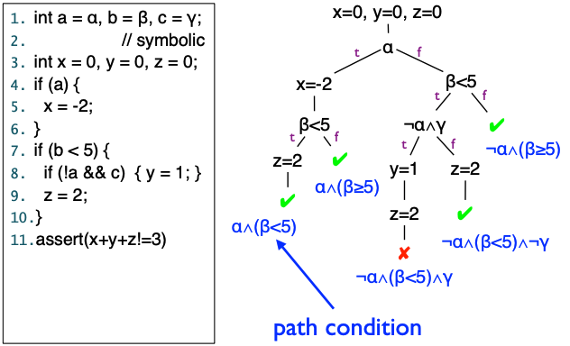

## Symbolic Execution Example with Path Condition

### Goals for Symbolic Execution in Bug Detection

* Is particular program point **reachable**?
  * By looking at if the path condition is satisfiable.
* Is array access `a[i]` out of bound?
  * By looking at if $i<0 \and i\ge \textrm{size}(a)$ is satisfiable.

When it comes to "satisfiable or not", we look at SMT/SAT solvers.

## Symbolic execution as a predicate transformation sematics

Given **symbolic state** and **path condition**, we assume it is true at the corresponding program point:

### Strongest post-condition transformations

Forward symbolic execution of a program.
$$
\text{if }\varphi \text{ before program C executes}, \text{then }\psi \text{ after program C executes.}
$$

### Weakest pre-condition transformations

Backward...
$$
\text{if }\varphi \text{ after program C executes}, \text{then }\psi \text{ before program C executes.}
$$
