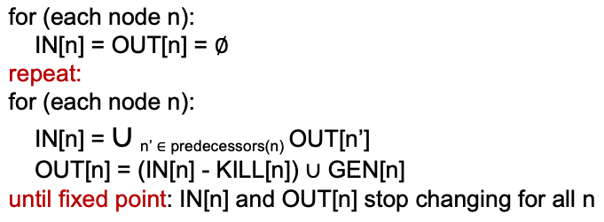
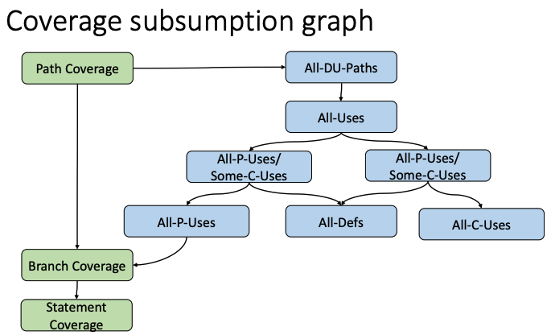

# Back to Basics

## Compile a Program

* Lexical Anal.
* Syntactic Anal.
* Semantic Anal. 
* Optimization.
* Code Gen;

## Context-free Grammar

> Big idea: 产生式左边只有一个终结符；

$$
G=\langle\Sigma, N, P, S\rangle
$$

* $\Sigma$ is the **alphabet**, meaning all symbols (small cases);
* $N$ a finite & non-empty set of **non-terminal** symbols;
* $P$ is a set of production rules;
* $S$ Stands for start symbols (one of the $N$);

* $\Sigma^*$ is all possible sentences of $\Sigma$;
* $L(G)$ is a subset of $\Sigma^*$ following $G$;

## CFG: Control-flow Graph

### Basic Block

In a basic block, you can simply execute all instructions starting from the 1st line to the final line line-by-line;

### CFG

$$
G=\langle N, E\rangle
$$

N: all blocks;

E: all edges;

**Build a CFG**: Connect any BB pair if one can be following the other;

### CFG-based code coverage

A practical way to **measure code quality**;

* **Stmt coverage:** well, you need to cover all BBs (nodes)!
* **Branch coverage:** You need to cover all edges!
* **Path coverage:** You need to cover all paths (between Strt & Term BB)!

> The number of paths could be infinite (loops) or exponential (branches)!

## Data-flow Analysis

> +南大静态分析的课；

### MAY Anal. & OVER Anal.

* Sound but incomplete：误报（may report spurious errors） 如果有（潜在）问题，你都会报告出来，但你报告出来的问题，可能有的是错的；
  * MAY anal. : outputs information may be true; (over-approx.)
    * 所以如果误报可以考虑人脑修复；
  * 一般都是静态分析；
* Complete but unsound 漏报：你报告出来的bug，都是没问题的，但可能有的报告没有被展示； 
  * MUST anal. : output information MUST be true; (over-approx.)
    * 在编译器优化的过程中，我们就要保证得到的信息都是MUST！
  * 主要是动态分析；

### Program Variable

is something whose value will be finally modified;

**use:** When a variable value is read

* **P-use**: predicate-use is the use in the branch predicate;
* **C-use**: computation-use is the use other than P-use;

Note that the **value** here is self-defined. For example, when you are talking about variable sign's, then you only need to regard the signs as the values.

### Common notions

* $\top$: Undefined;
* $\bot$: Unknown;

2 key components:

* Transfer function
* Control-flow handling

> For example, in sign analysis, the transfer function is `+ * - = - | + * + = + | - * - = +`.

### Inp/Output States

Each IR statement may transform the state of input/output data.

* 1-1
* 1-many
* Many-1: use the meet notation: $\and$ 

In data-flow analysis, you need to:

* specify the constraints of each statement (transfer function);
* Control-flow-based constraint

### Example: Reaching Def （可达定义分析）

For a variable $v$, from program point $a\to b$ (it is a path), it is not re-defined (definition and assignment are all `re-def`).

Thus, for a variable, by finding its reaching definition, we can do:

* Build use/def chains;
* Constant propagation;
* Loop invariant code motion;

#### Transfer Functions

* Across BB

$$
\textrm{IN}[n]=\cup_{n'\in \textrm{predecessor}(n)}\textrm{OUT}[n']
$$

* Intra BB

$$
\textrm{OUT}[n]=\left(\textrm{IN}[n]-\textrm{KILL}[n]\right)\cup \textrm{GEN}[n]
$$

#### Reaching Def Algo

This will be terminated since the IN and OUT set will only be growing and they are finite so they cannot be growing for ever.

#### Other Dataflow Analysis

Live Variable Analysis: dead code elimination;

Available Expression Analysis: avoid recomputing expressions;

Very Busy Expressions Analysis: reduce code size;

### May/Must another view

At join point

Must = $\phi$ must be met by all sub-paths;

May = $\phi$ may be met by some sub-paths;

## Data-flow-based Code Coverage

Traditional code coverage did not consider **data**. That said, though the paths remain the same, different tests have different variable values defined/used!

### Def-clear path

For variable v, a path that has no re-def.

### DU-pair (DU -> define/use)

(d, u) 

* **d**: a node defining v;
* **u**: a node**/edge** using v
  * an outgoing edge if u is a **p-use**;

### DU path

$$
\langle n_1,n_2,\cdots, n_j, n_k\rangle
$$

* $n_1$ is a def node;
* either
  * $n_k$ is c-use && $\langle n_1,n_2,\cdots, n_k\rangle$ is a def-clear path (all nodes, except d,u are **distinct**).
  * nj -> nk are p-use && $\langle n_1,n_2,\cdots, n_j\rangle$ is a def-clear **loop-free** path for x (all nodes are **distinct**).

### Traditional dataflow-based testing

Identify all DU pairs and construct testing cases that cover these pairs.

* **All-Def** needs more tests!