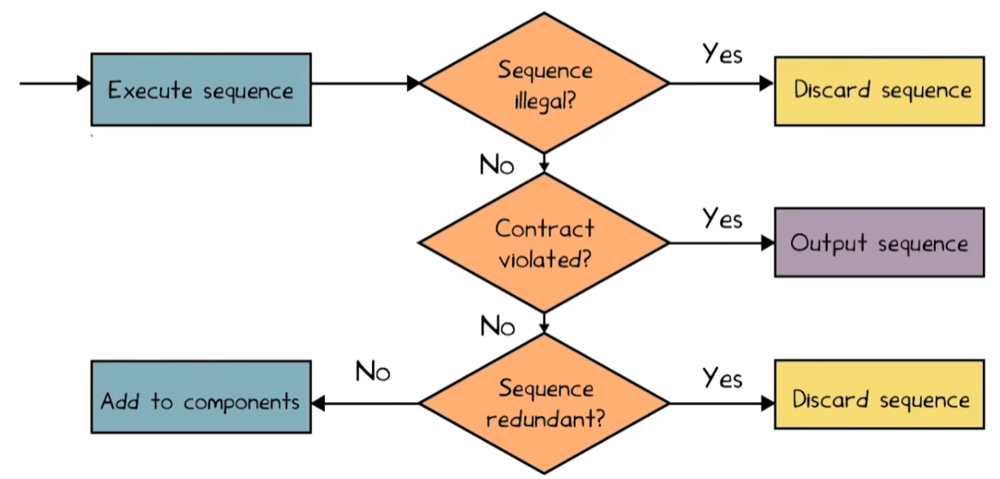

https://lingming.cs.illinois.edu/courses/cs598ast-f20/unit_testgen.pdf

## Terms

* Test case:
  * Input;
  * Test oracle;
  * optional execution steps;
* Test suite: a finite set of tests;
* Test adequacy: code coverage;

## Testing levels

## AutoUniTestGen 

#### Naive method: Generate a random sequence of invocations

Requirements:

* Random methods;
* Random parameters;
* Random receiver object;

Shortcomings:

* No test oracles;
* Cannot generate complex tests;
* Possible redundant & illegal tests;

#### Randoop: feedback-directed (adaptive) random test generation

**Input**:

* Class to be tested;
* Time limits;
* Contracts:
  * Method contracts (e.g., formalizing the behavior of a method);
  * Object invariants (e.g., object == object);

**Output**: Contract-violating test cases.

**Algo**:

* Incrementally add call methods with random parameters from a value pool.
* Discard if this function is exactly the test case is lexically the same as previous ones.
* Run the test and do classification:

The illegal sequence here is the one causing a crash (throwing an exception) before the assertion.

**Check redundancy**:

* For each sequence, record all objects created during execution;
* Discard new tests whose created objects are the same as that of any previous sequence;

**Why auto-test-gen not so popular decades ago**: 

* Test generation relies heavily on **type information**;
* C & Lisp did not provide the needed type;
* Strong-type languages (e.g., Java) are better for auto test generation;

#### Whole Test Suite Generation (TSE'12)

The test case space might be too huge to be fully covered. Instead, we might leverage **genetic algorithm** to generate test suites heuristically.

**Test-suite-level crossover**: Select 2 test suites and exchange some test cases;

**Mutation**: Just change some functions;

In each iteration, we may have multiple new test suites: We select them by a heuristic function (fitness function, **lower is better**).
$$
F(T)=|M_{unique}|-|M_T|+\sum_{b\in B}\mathcal D(b, T)
$$

* We want to test all unique methods: $|M|-|M_T|$
  * i.e., # unique methods - # unique methods in this test suite;
* Cover more branches: $\sum_{b\in B}\mathcal D(b, T)$
  * We expect the predicate to be run at least twice (we hope it can cover true & false) !!! Note that one predicate has 2 branches!
  * For each branch in T: 

$$
\mathcal D(b,T)=\left\{
\begin{array}{ll}
0 & \textrm{The branch is covered in T!} \\
1-\frac{1}{\mathcal D_\min(b, T)+1} & \textrm{Not covered, but predicate is executed at least twice.} \\
1 & \textrm{Not covered, but predicate is executed < twice.} \\
\end{array} 
\right.
$$

The 2nd item is used as a normalized function.

