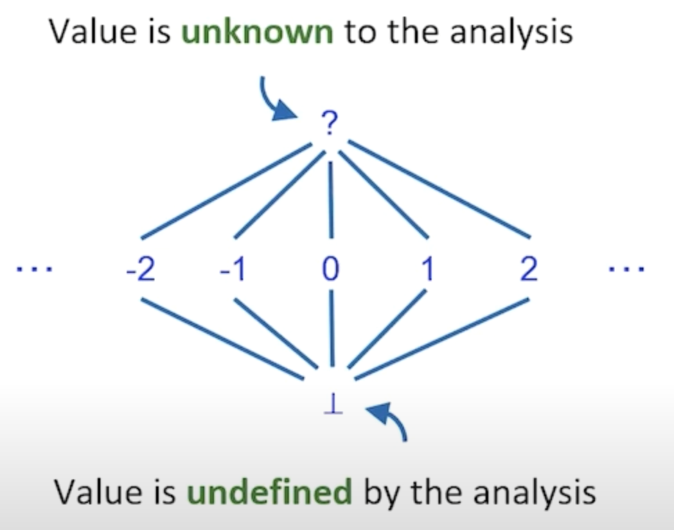
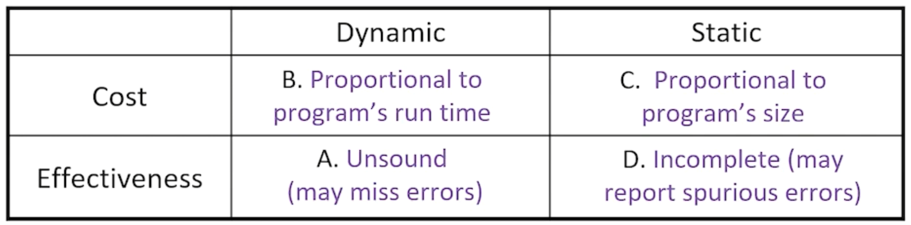
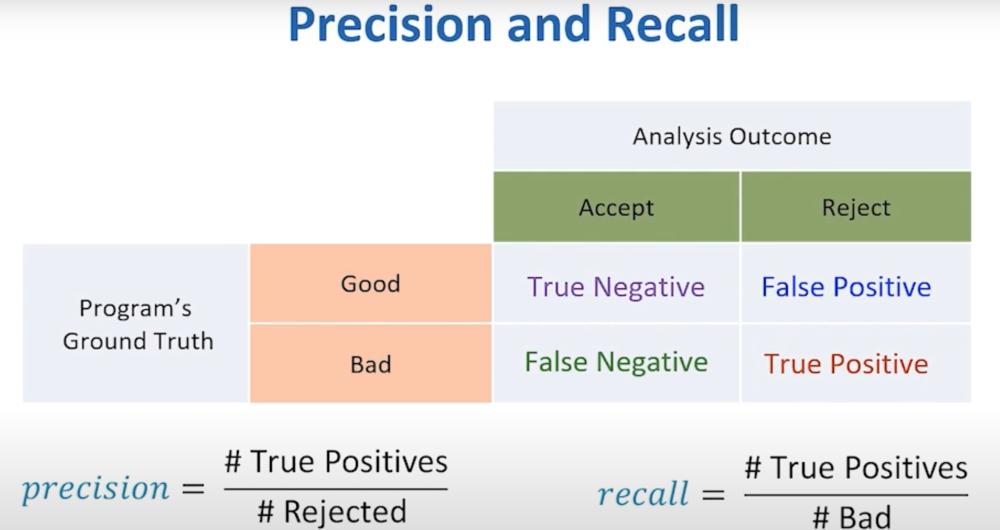

## Abstract Domain

Common steps for static analysis:

* Define abstract domain;
* Try to find out if variable values are **deterministic** or **unknown** (the value cannot be inferred).
* When one variable may have more than 2 values in something like a loop, then it means this value is **unknown**;

## Complete or sound

Given a property $\phi$, where we believe this is a "good property"; A good program should follow $\phi$;

A **sound** *Program Analysis* should accept some (not all) of the "good programs", while a **complete** one must accept them all. Also, a sound analysis should not accept any "bad" program while a complete one may;

In other words, a **sound** analysis' error report will be the super set of $\phi$ (report all possible $\phi$ related bugs!)

a **complete** analysis' error report will be the sub set of $\phi$ (may miss some errors, but the reports are definitely correct).

## Evaluation

A stand measurement is **F-Measure** (F1 in statistics):
$$
\textrm{F Measure} = \frac{2}{\frac{1}{\textrm{precision}}+\frac{1}{\textrm{recall}}}
$$

## Program analysis for what

* Detect bugs;
* Find program invariants; (An invariant (in common sense) means some conditions that must be true at some point in time or even always while your program is executing.)
* Generating test cases;
* Localize cause if errors;
* Auto-debugging;

