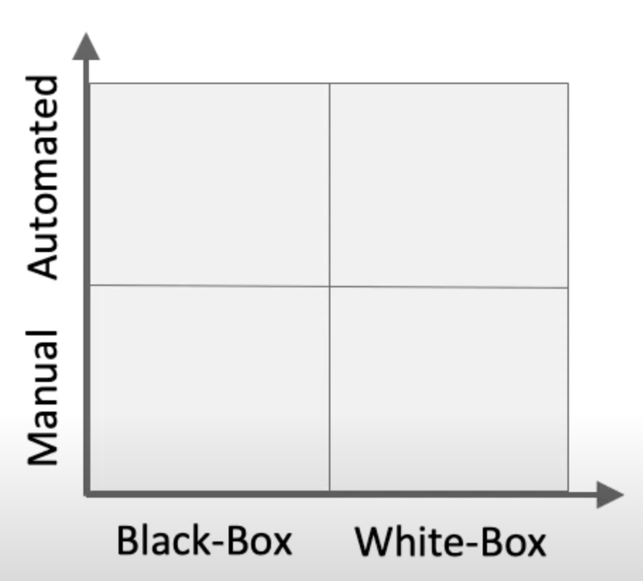
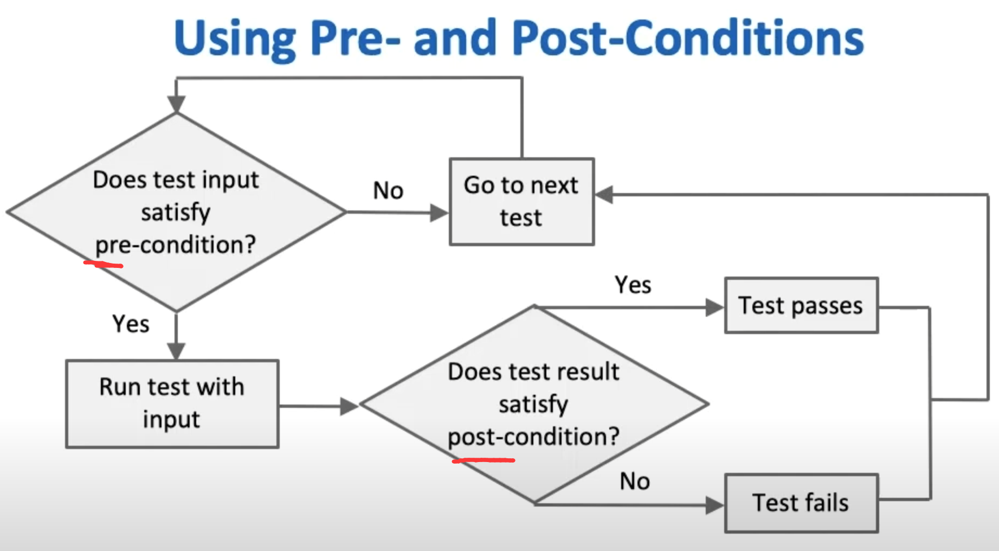
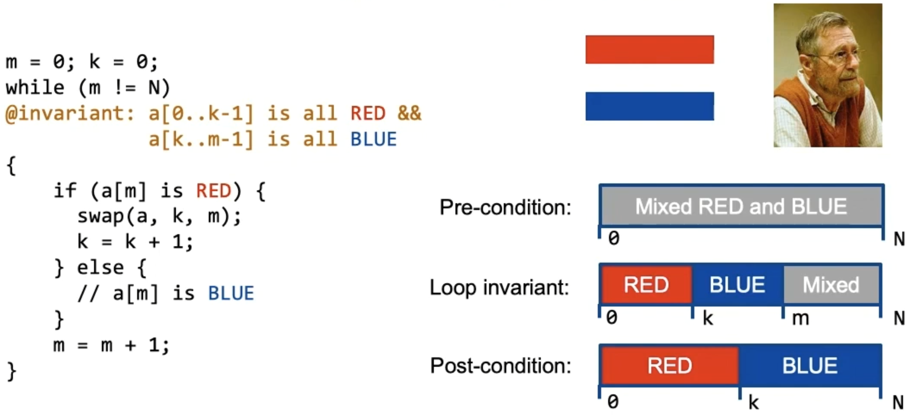
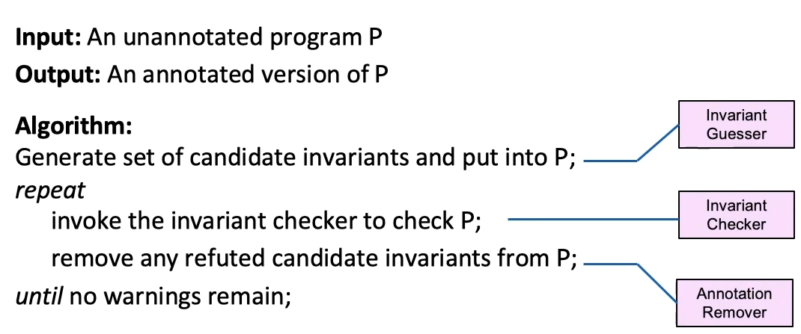

## Classification of Testing



* White-Box: Tester can leverage what is inside the program when testing; (so you can directly perform static analysis on the source codes)
* Black-Box: You cannot see what is inside; (specify the inputs and relative outputs for verification)
* [More than those two] Grey-Box: You know part of the information;

## Common forms of safety properties

* types; (statically-typed or dynamically-typed)
* type-state properties;
* assertions;
* pre- and post- conditions; (no help in writing tests but helps run them)
* loop and class invariants;
  * Find some **invariant properties**;

## Type-State Properties

refines types with finite state information;

* SOCKET -> CONNECTED;

such properties which operations are valid in each state and their effects; (also called temporal safety properties)

Example:


> C++draft on mutex: https://eel.is/c++draft/thread.mutex.requirements#mutex.general-22

## Pre- and post- conditions



## Loop and class invariants

> Typically we have 2 ways to verify our program:
>
> * Formal verification: expensive annotation effort;
> * Testing: incomplete;

### Loop invariants example: 



### Class Invariant

all [**public**] method must preserve some *statements*; like `self.num != 0`;

Here, pre-conditions are about arguments; and post-conditions are about return values;

### Houdini Algorithms: An algorithm to find out invariants;

> Programmers are reluctant to write and maintain specifications; So can we automatically find out some kind of approaches to generate class invariants, where they must be **sound** (will not take right conditions as bugs);

An annotation assistant for the static modular verifier ESC/Java; 

* Idea: Generate many (as many as possible) **candidate invariants** and employ ESC/Java to verify or refute each;

Some examples of candidate invariants (looks like *assertion*):

```java
// @ invariant i cmp j; cmp \in {<, <=, ==, =>, >}
// @ invariant ptr != null;
// @ invariant (forall int k; 0 <= k && k < a.length ==> a[k] != null)
```



Pros:

* loop invariants & method contracts;
* infer the strongest invariant in the candidate set;
* easy;

Cons:

* only infer **conjunctive invariants**: `a && b && c`...
* More candidates : more expensive; less candidates : worse annotations;

## Code coverage

That is: do we have all **possibilities** in the **function/decision/statement/condition**  space well tested?

[Wiki](https://zh.wikipedia.org/zh-cn/%E4%BB%A3%E7%A2%BC%E8%A6%86%E8%93%8B%E7%8E%87)

## Mutation Analysis

test variations of the program;

change some parts of the expression;

* If the test suite is good, we should report failed test cases in the mutants;